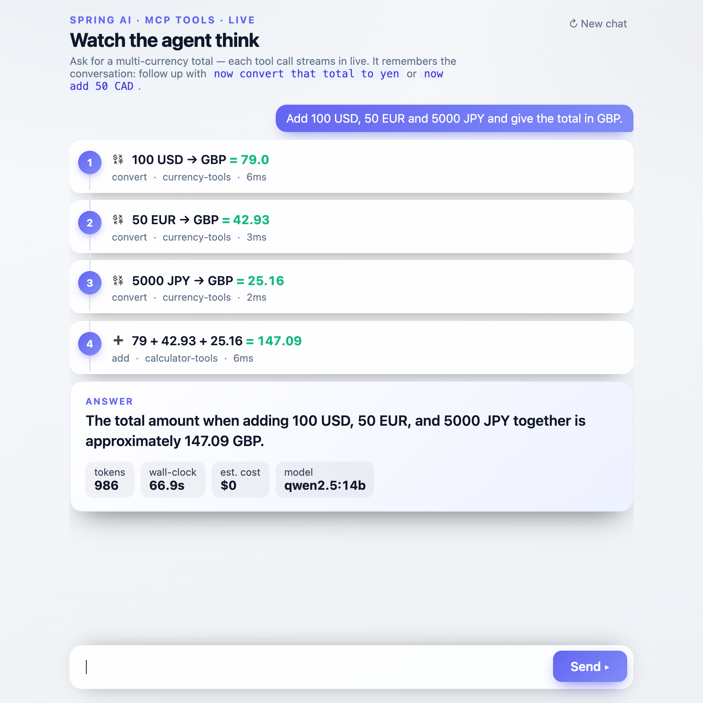
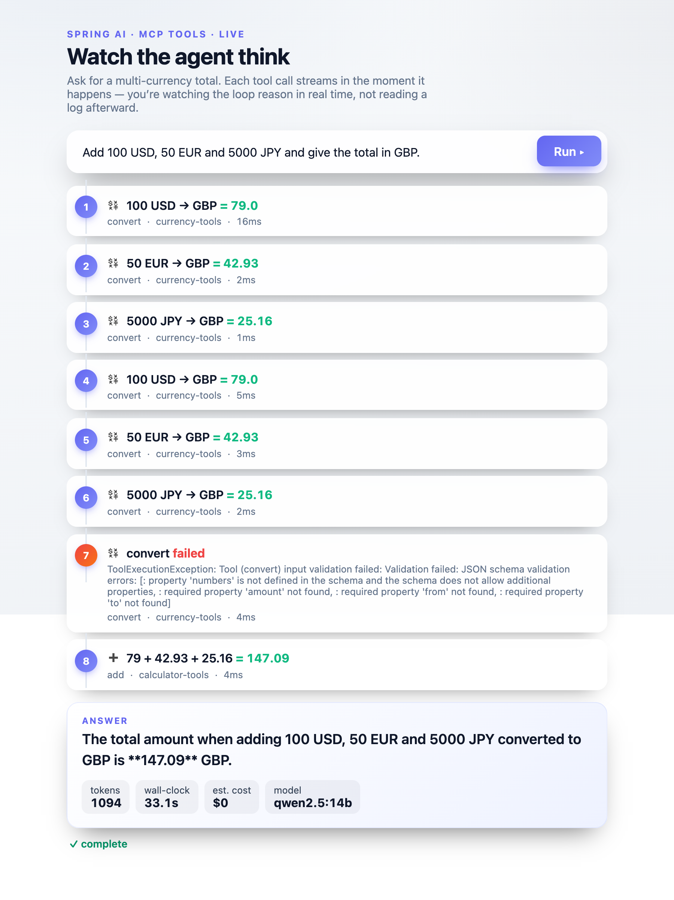

# Chapter 9 — Watching It Think *(Phase 5)*

## What we wanted to learn

This is the finale, and the reason the project exists. From the start, "observability" meant one
concrete thing: **a person watching the agent work, live, step by step, as it happens** — not
reading a log after the fact, not polling for a final result, but *seeing the loop think in real
time.* Everything before this was building toward being able to do it honestly.

## The core challenge

Spring AI runs the tool-calling loop *inside* the model call and hands back only the finished
answer. So "stream the intermediate steps" isn't something the framework offers — the steps are,
by design, hidden inside one blocking call. We had to pry them out.

The good news: we'd been capturing every step since Phase 0. Until now the capture hook *collected*
steps and returned them at the end. To go live, we change one thing — the hook also **emits** each
step the instant it fires:

```java
// in the collector, when a step is recorded:
if (listener != null) listener.accept(step);   // push it now, don't wait for the end
```

That's the whole trick. The same `Step` data as every phase, pushed the moment the tool returns
instead of collected for later.

## What we built

- **An SSE endpoint** — `GET /agent/stream?input=…`. It runs the loop on the background executor
  and, via a step listener, pushes each step onto a **Server-Sent Events** stream as it happens,
  then a final `answer` event (with the cost/usage block) and `done`. GET, so a browser's native
  `EventSource` can connect.
- **A single HTML page** (`static/index.html`) — a text box, a button, and a styled timeline that
  renders each step live as it streams in. No framework, just the browser's `EventSource`. Open
  `http://localhost:8080/` and watch.

The same step data flows everywhere now: logged (0), chained (1), error-annotated (2),
context-aware (3), priced (3.5), persisted (4), and finally **streamed live (5)** — one hook, six
phases.

## What actually happened

Consuming the raw event stream from the command line (with timestamps, to prove the events arrive
*as the loop runs*, not all at once at the end):

```
12:41:11  event: status   {"state":"thinking"}
12:41:32  event: step      1. convert  USD→GBP = 79.0          ← 21s later (model deciding)
12:41:32  event: step      2. convert  EUR→GBP = 42.93
12:41:32  event: step      3. convert  JPY→GBP = 25.16
12:41:40  event: step      4. add [79, 42.93, 25.16] = 147.09  ← +8s
12:41:44  event: answer   "…the total … is 147.09 GBP"  {tokens, wall-clock, $}
12:41:44  event: done
```

The events are **smeared across ~33 seconds**. The gaps between bursts are the model *thinking* —
deciding which tool to call next. If the steps were collected and dumped at the end, every line
would share one timestamp. They don't. You are, genuinely, watching it think.

In the browser, the same thing renders as lines appearing one at a time: `… thinking`, then
each step as a card on a little timeline, with the answer and its cost dropping in at the end:



### A real run isn't always tidy

That clean four-step capture took a small fight to get — and the fight is itself a lesson. Our
first screenshots of the *page* kept coming out messy: the model would convert all three amounts,
then **convert them all again**, sometimes fumbling a tool call along the way, before finally
adding. Here's an honest capture of that:



Step 7 is a real failure — the model called `convert` with `add`'s arguments and the server
rejected it — yet the loop recovered and still landed on 147.09. Watching live, you *see* all of
it: the redundancy, the stumble, the recovery.

Why messy now when earlier tests were clean? **The prompt.** Our earlier command-line tests said
"use the tools for every conversion and for the addition"; the page used a terser prompt, and qwen
filled the ambiguity by over-converting. A one-line addition to the system prompt — *"convert each
amount exactly once; do not double-check by re-running tools"* — settled it. Same lesson as
Chapters 3 and 7, one more time: with these models, *how you ask* visibly changes what the loop
does — and a glass-box agent is what let us see the difference and fix it.

By now the system prompt has accreted three rules, each added the moment a run showed it was
needed: **order** (convert before adding — Ch 3), **types** (JSON numbers, not strings — Ch 3),
and now **no redundancy** (convert each amount once). None were designed up front; each answered an
observed failure. That's **prompt engineering** in practice — not a one-shot magic incantation, but
a short list of rules you accrete by watching the loop misbehave and naming exactly what it got
wrong. *(We never changed the model itself — it's stock `qwen2.5:14b`; only its instructions
evolved.)*

## What it taught us

- **"Live" is a push, not a poll.** Phase 4 let you *ask* for status; Phase 5 *pushes* each event
  the instant it exists. The difference between "is it done yet?" and "here's what just happened" is
  the difference between a progress bar and watching over the agent's shoulder.
- **The finale cost almost nothing — because of Phase 0.** Streaming was a one-line change to the
  capture hook (emit as well as collect) plus a thin SSE endpoint and an HTML file. The hard part —
  *capturing* the steps out of an opaque loop — was solved on day one. Every phase since has been
  cashing in that one early decision.
- **Observability is a design stance, not a tool.** We never added Micrometer, OpenTelemetry, or a
  tracing backend. "Watch it think" was achievable with a `Consumer<Step>` and `EventSource`,
  because the system was built to expose its own steps from the start. The heavy tooling answers
  different questions (fleet-wide metrics, distributed traces); *this* question — let a human see
  the loop — just needed the handrail.

## Where this leaves us

The agent now reasons across tools, recovers from failures, remembers conversations, reports its
cost, runs detached, and can be **watched live as it works.** That was the whole goal.

What's deliberately *not* here is a frontier: planning and multi-agent decomposition (Phase 6) —
where an agent breaks a goal into sub-tasks or delegates to other agents, and "agent" becomes
"system." It's noted, not built; the foundation laid here is what you'd build it on.

If you've followed from Chapter 1: you didn't just wire up an agent. You watched, at each rung,
*where the hard parts actually are* — the model's reliability ceiling, the value of a clear error
message, that memory carries mistakes forward, that the loop is the cost multiplier — and you have
a glass-box agent you can see straight through.

→ *Phase 6 (planning / multi-agent) — frontier, optional, not built.*
