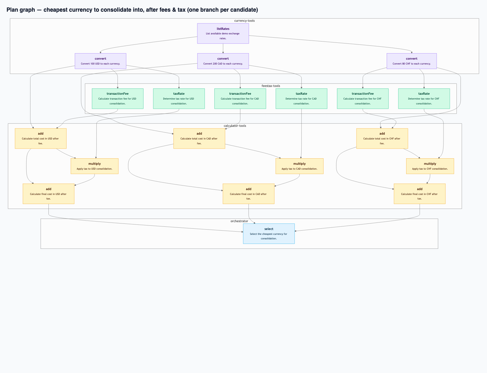

# Chapter 10 — Watch it Plan

*(Phase 6 · the optional frontier)*

> **What we wanted to learn → What we built → What actually happened → What it taught us.**

For nine chapters the agent was a *reactive loop*: hand it a goal, and it calls one tool, sees the
result, calls the next, and so on until it's done. That loop is powerful — but it never steps back
and *designs* an approach. This final chapter asks the one question left on the ladder: can the
model take a fuzzy goal and produce an explicit **plan** — and can we *see* it?

## What we wanted to learn

One concept, isolated: **decomposition.** Not "agents that do things in parallel" — we tried that
and it taught us mostly that wrapping a one-tool call in its own LLM is wasteful. The honest,
narrower question is simpler and more useful:

> Is a model good at turning a goal into a **structured, dependency-aware plan** over the tools it
> has — and is that plan worth looking at?

So we built a phase that **plans but never executes.** The model's entire job is to emit a graph of
steps and how they depend on each other. Nothing runs. The graph is the whole point.

## What we built

Three pieces, all small:

1. **A third specialist.** Currency + calculator alone make for a dull plan. So we added a
   `fees/tax` MCP server — `transactionFee(amount, currency)` and `taxRate(currency)`, with fixed
   demo numbers like the currency server's rates. Crucially, **these tools are never called.** In a
   planning phase the model only needs to *know a tool exists*, so a whole new capability costs
   almost nothing — and it stays honest: the tool lives in a real MCP server, discovered over the
   wire, never hardcoded into the agent.
2. **A tool catalog.** At startup the agent asks every connected server what it offers — names,
   descriptions, parameters — and hands that list to the planner. The model plans against the *real*
   catalog, not a hand-typed menu.
3. **One model call.** `POST /agent/plan` runs a single, tool-less prompt: *"decompose this goal
   into a JSON graph of `{id, specialist, op, summary, inputs}` nodes."* We parse the JSON and
   **validate** it — unique ids, every dependency points at a real step, and the graph is acyclic
   (a classic topological check). A bad plan is rejected with the raw text shown, so you can see
   *what* the model produced and *why* it didn't pass.

Then `/plan` draws the result with Mermaid, one box per specialist, color-coded.

## What actually happened

We asked it a question a single flat agent would struggle to keep straight:

> *"What's the cheapest currency to consolidate 100 USD, 200 CAD and 80 CHF into, after transaction
> fees and tax?"*

One call later — about 1,000 tokens — the model returned a graph that genuinely *compares the
options*: it lists the rates, then builds **one branch per candidate currency** (USD, CAD, CHF) —
each converting the holdings, looking up that currency's fee and tax rate, and combining them into a
final cost — and ends with a single **orchestrator** `select` node that takes **all three** branch
costs and picks the cheapest. Independent steps sit side by side (they'd parallelize); dependent
steps point at their prerequisites. That whole shape came from the model — we wrote none of it.



### The first draft was wrong — and the graph is why we knew

It didn't start this clean. Our *first* planner produced a plan that quietly collapsed everything
into **USD as a single reference currency** — no real comparison — and wired up a
`multiply(value, taxRate, fee)` that means nothing dimensionally. A prose answer would have hidden
that behind a confident paragraph. The **graph made the flaw impossible to miss**: a "cheapest
currency" question whose final `select` had only *one* input is plainly not comparing anything.

So we fixed it where the problem actually was — the planner's *prompt* (its context): tell it to
enumerate the candidates and build one branch each for "cheapest/best" goals, to attribute every
tool to the server that really provides it, and to keep units consistent (a fee and a tax are their
own steps; never multiply money by a percentage). The graph above is the result. **Being able to
*see* the plan is exactly what let us catch and fix it** — trust the graph, not the paragraph.

It's still the model, though. Push the goal bigger — all five holdings instead of three — and the
14B model starts dropping a node it referenced; the validator then rejects the plan (a 422 with the
raw text shown) and a re-run usually fixes it. Planning is non-deterministic, and bigger goals strain
a small model — a thread we pull harder in Chapter 11.

> **A small trap worth recording.** We vendored Mermaid to keep the page working offline, and the
> graph stubbornly refused to render — the page just said "rendering…". The cause: `mermaid.min.js`
> is a *global* build that hangs itself on `window.mermaid`, not an ES module, so
> `import mermaid from …` quietly produced nothing. Loading it as a plain `<script>` and using the
> global fixed it. The same "the artifact isn't the shape you assumed" lesson, one floor down in the
> stack.

## Three goals, three shapes

The page lets you stack goals and compare how each decomposes — that's the whole point. Three worth
trying, from trivial to optimization:

**1 — a plain total.** *"Convert 100 USD and 50 EUR to GBP and give the total."* A three-node graph:
two independent `convert`s (currency) feeding one `add` (calculator).

```
convert 100 USD → GBP ┐
                      ├─► add  (total in GBP)
convert  50 EUR → GBP ┘
```

**2 — a portfolio report.** *"I hold 100 USD, 50 EUR, 5000 JPY, 200 CAD and 80 CHF. In GBP: total,
largest and smallest holding, and the total without JPY."* About ten nodes: `listRates` → five
`convert`s → two `add`s (the full total, and a second total that simply omits JPY) → two orchestrator
`select` nodes for the largest and smallest holding. The model pulls four distinct deliverables out
of one sentence and wires each to the conversions it needs.

**3 — an optimization.** *"What's the cheapest currency to consolidate 100 USD, 200 CAD and 80 CHF
into, after transaction fees and tax?"* — the graph pictured above: **one branch per candidate
currency**, each `convert → fee + taxRate → combine`, all converging on a single `select` that
compares the three final costs. This is the one that needed the planner-prompt fix; the two simpler
goals never did.

Same planner, same tools — the *shape* is entirely the model's reading of the goal. Stack all three
on the page and the contrast (a 3-node line vs. a fan-in vs. parallel branches) is the lesson.

## What it taught us

- **The model's gift is structure, not execution.** Given a goal and a catalog, it reliably
  produced a *valid, dependency-aware decomposition*. That — turning fuzzy language into a graph —
  is the genuinely useful thing an LLM does here. The arithmetic, by contrast, we'd want a
  deterministic runtime to do.
- **A plan you can see is a plan you can check.** The whole project's refrain — *trust the steps,
  not the prose* — reaches its final form: trust the *graph*, not the paragraph. The visualization
  turned "is this reasoning sound?" from a guess into a glance.
- **Validation is part of planning.** A model-designed graph can dangle a reference or close a loop.
  Catching that (and showing the raw text when we do) is the difference between a demo and something
  you'd trust to feed an executor.
- **Cheap honesty beats expensive theater.** This phase is one model call and zero tool executions.
  It makes a real point without pretending a fleet of sub-agents was necessary. That restraint is
  the lesson the earlier, fancier draft couldn't teach.

And there the ladder ends. The obvious next rung — actually *running* the validated graph with a
dependency-driven executor, the model as planner and plain code as the runtime — is real
agent-systems territory, and a good place to stop a book about understanding the machinery. We can
now see the agent loop, watch it think, and watch it plan. That was the whole goal.

## Try it yourself

Open the planning page and hit **Plan**:

```
open http://localhost:8080/plan
```

Or get the raw graph from the command line and pick it apart with `jq`. Try each of the three goals —
swap `GOAL` and re-run to watch the shape change:

```bash
# 1 — plain total (3 nodes):
GOAL="Convert 100 USD and 50 EUR to GBP and give the total."
# 2 — portfolio report (~10 nodes):
GOAL="I hold 100 USD, 50 EUR, 5000 JPY, 200 CAD and 80 CHF. In GBP: total, largest and smallest holding, and the total without JPY."
# 3 — cheapest consolidation (branches per candidate):
GOAL="What's the cheapest currency to consolidate 100 USD, 200 CAD and 80 CHF into, after transaction fees and tax?"

# the nodes, grouped by which specialist would run them:
curl -s -X POST http://localhost:8080/agent/plan -H 'Content-Type: application/json' \
  -d "$(jq -n --arg i "$GOAL" '{input:$i}')" \
  | jq -r '.graph.nodes[] | "\(.specialist)\t\(.op)\t\(.summary)"' | column -t -s $'\t'

# the dependency edges (what feeds what):
curl -s -X POST http://localhost:8080/agent/plan -H 'Content-Type: application/json' \
  -d "$(jq -n --arg i "$GOAL" '{input:$i}')" \
  | jq -r '.graph.nodes[] | select(.inputs|length>0) | "\(.inputs|join(", ")) -> \(.id)"'

# how cheap planning is — one model call:
curl -s -X POST http://localhost:8080/agent/plan -H 'Content-Type: application/json' \
  -d "$(jq -n --arg i "$GOAL" '{input:$i}')" | jq '.usage'
```

Run it a few times and watch the graph change shape — same goal, different plans. That variability,
laid out as a graph you can actually read, is the thing worth seeing.
