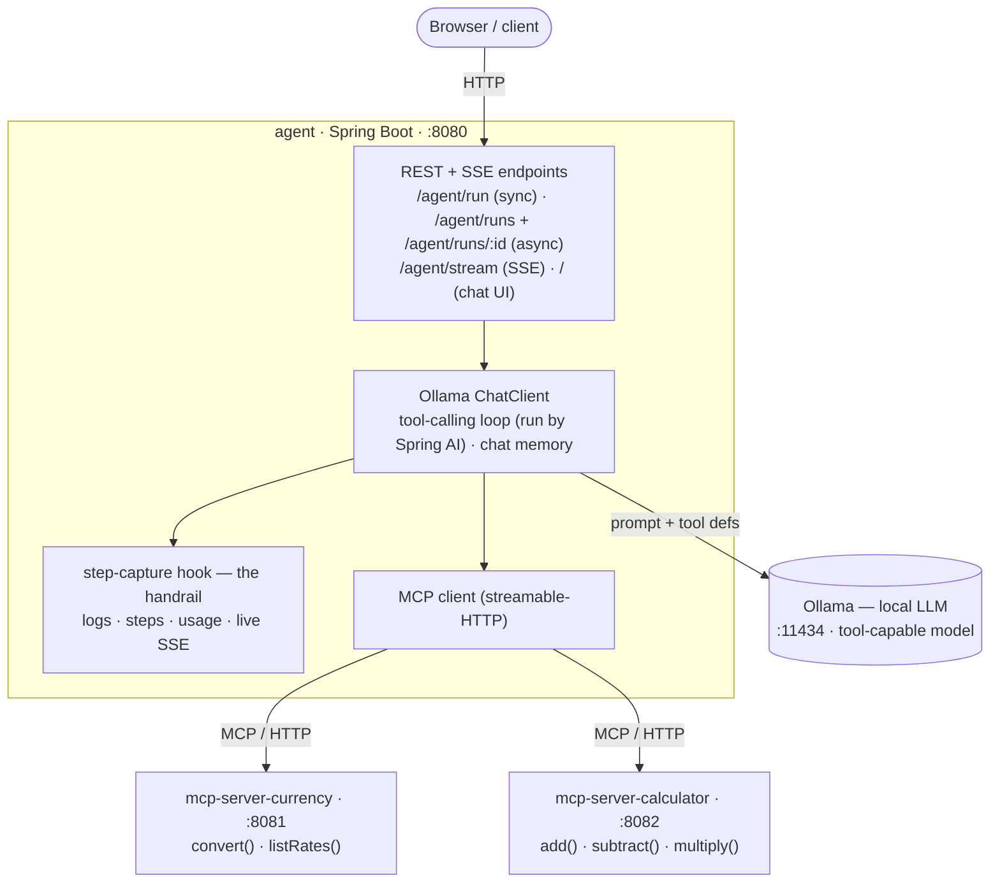
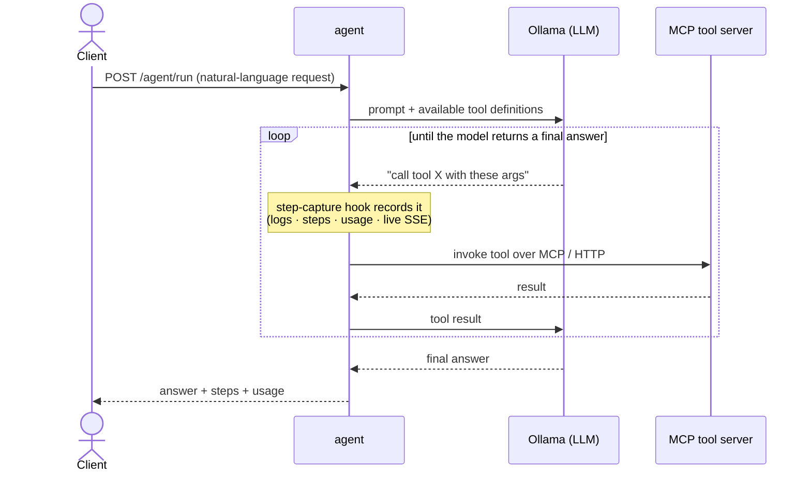

# Architecture overview

> Target shape, reached gradually. The codebase lags this until each phase lands.
> Decisions behind it: [ADR-0002](../adr/0002-local-llm-via-ollama.md) (Ollama),
> [ADR-0003](../adr/0003-tools-over-mcp-only.md) (tools over MCP only),
> [ADR-0004](../adr/0004-phased-learning-build.md) (phased build).

## Components

## Boundaries (invariants — hold these throughout)

- **Agent ≠ MCP server.** Servers are passive tool providers; the agent orchestrates.
- **Tools only over MCP/HTTP.** The agent never imports a server's Java classes.
- **Loop never inside a server.** The tool-calling loop lives in the agent only.
- **Agent state outside the request.** No conversation/run state in controller/instance fields.
- **No hardcoded model or URLs.** Everything via config properties.

## The agent loop

Spring AI runs the tool-calling loop internally: the ChatClient sends the user request +
available tools to Ollama; the model decides which tool(s) to call; Spring AI dispatches each
call over the MCP client to the right server, feeds results back, and repeats until the model
produces a final answer.

The **step-capture hook** (built in Phase 0) intercepts each tool call and records
`{ step, tool, server, arguments, result, latencyMs }`. This same step data is the through-line
of every phase — the project's notion of observability is a human *seeing these steps*.

Over time, a single request flows like this (the loop lives *inside* the ChatClient call):

## How the picture grows (phase by phase)

| Phase | What changes in this diagram |
|-------|------------------------------|
| 0 | One server (currency) + agent. Sync `POST /agent/run` returns `{answer, steps[]}`. Hook logs + returns steps. |
| 1 | Second server (calculator) joins; both tools merge into one toolset. Steps show a multi-step chain (convert×3 → add). |
| 2 | No new components — tools surface errors; the step record captures them. Observe how the loop reacts. |
| 3 | Chat-memory advisor keyed by `sessionId`; follow-ups resolve context. State stays outside the request. |
| 4 | `POST /agent/run` returns 202 + runId; loop runs detached; a run store persists status + steps; `GET /agent/run/{id}` polls. Safety cap on steps/wall-clock. Sync endpoint stays. |
| 5 | SSE endpoint pushes each step live as it fires; a single-file HTML page renders them. Same step data, now streamed. |
| 6 | (optional) planning / multi-agent — agent decomposes goals or delegates. Build only if asked. |

## Tech

- **Build:** Maven multi-module — parent POM + `agent`, `mcp-server-currency`,
  `mcp-server-calculator`.
- **Runtime:** Spring Boot apps + external Ollama. Local git only.
- **Versions / artifact IDs / config keys:** verify against *live* Spring AI docs before
  wiring — tracked in [`../../NOTES.md`](../../NOTES.md), not pinned here.
